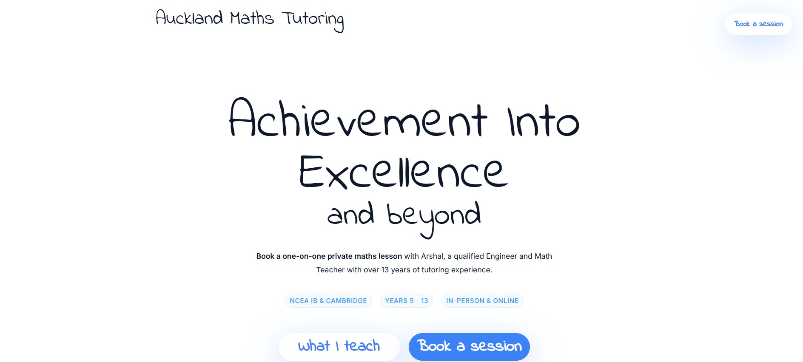

# Auckland Maths Tutoring Website



A modern, responsive tutoring website for Auckland Maths Tutoring built with Vite and Tailwind CSS v4.1. The website showcases professional math tutoring services with an elegant design and smooth user experience.


## 📌 Features
✅ **Responsive Design** – Optimized for all screen sizes (mobile, tablet, desktop)  
✅ **Modern UI/UX** – Clean, professional design with smooth animations  
✅ **Interactive Elements** – Hover effects and smooth transitions  
✅ **Service Sections** – Detailed breakdown of tutoring services (NCEA, IB, Cambridge)  
✅ **Student Testimonials** – Social proof with student reviews  
✅ **Contact Integration** – Easy booking and contact options  
✅ **SEO Optimized** – Proper meta tags and semantic HTML structure  

## 🎓 Services Offered
- **NCEA** – Levels 1, 2, and 3 with Merit and Excellence focus
- **International Baccalaureate** – SL and HL mathematics curriculum
- **Cambridge** – IGCSE, AS, and A-Level mathematics
- **General Math** – Foundational support for Years 5-13
- **Flexible Learning** – Both in-person and online sessions

## 🛠 Tech Stack
- **Build Tool:** Vite
- **CSS Framework:** Tailwind CSS v4.1
- **Icons:** Font Awesome 6.7.2
- **Fonts:** Custom typography with indie and rank font families

## 📂 Installation & Setup

### Prerequisites
- Node.js (v16 or higher)
- npm or yarn

### Clone the repository:
```sh
git clone https://github.com/iamarshalrejith/auckland-maths-tutoring.git
cd auckland-maths-tutoring
```

### Install dependencies:
```sh
npm install
```

### Install Tailwind CSS v4.1:
```sh
npm install tailwindcss@next @tailwindcss/vite@next
```

### Start the development server:
```sh
npm run dev
```
Open [http://localhost:5173/](http://localhost:5173/) in your browser.

### Build for production:
```sh
npm run build
```

### Preview production build:
```sh
npm run preview
```

## 📂 Project Structure
```
auckland-maths-tutoring/
│── public/
│   └── assets/
│       └── profile.png      # Tutor profile image
│── src/
│   ├── styles/
│   │   ├── style.css        # Main stylesheet
│   │   └── math.css         # Math-specific styles
│   └── index.html           # Main HTML file
│── vite.config.js           # Vite configuration
│── tailwind.config.js       # Tailwind CSS configuration
│── package.json             # Project dependencies
└── README.md                # Project documentation
```

## 🎨 Design Features

### Color Scheme
- **Primary:** Slate tones (slate-900, slate-800, slate-600)
- **Accent:** Blue (#3B82F6) for interactive elements
- **Background:** Clean white with dark sections for contrast

### Typography
- **Headings:** Large, bold typography (6xl to 8xl) for impact
- **Body:** Clean, readable text with proper line spacing
- **Special:** Custom indie and rank font families for personality

### Components
- **Hero Section:** Large typography with call-to-action buttons
- **Service Cards:** Interactive cards with hover effects
- **Testimonials:** Clean card-based layout for student reviews
- **Contact Section:** Simple, direct contact information

## 📱 Responsive Breakpoints
- **Mobile:** Default styles
- **Small (sm):** 640px and up
- **Medium (md):** 768px and up
- **Large (lg):** 1024px and up

## 🚀 Deployment

### Build the project:
```sh
npm run build
```

### Deploy to popular platforms:
- **Vercel:** Connect your GitHub repo to Vercel
- **Netlify:** Drag and drop the `dist` folder
- **GitHub Pages:** Use GitHub Actions for automated deployment


## 🤝 Contributing
Contributions are welcome! Please feel free to submit a Pull Request.

## 📄 License
This project is licensed under the MIT License - see the [LICENSE](LICENSE) file for details.
